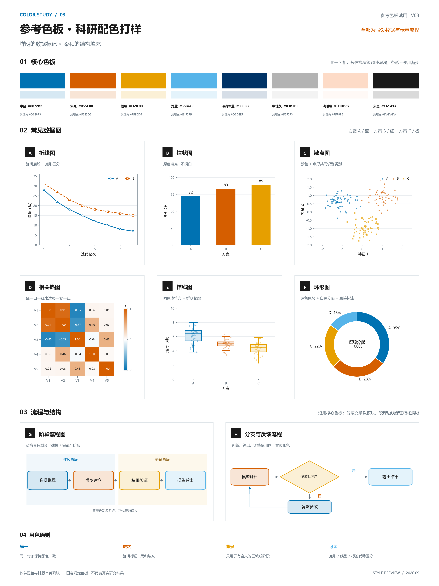

# CUMCM 论文绘图总控 Skill

根据完整数学建模论文、数据与代码规划和制作图表，按图型选择渲染器，并检查数值、文字、布局、灰度、导出和来源证据。默认使用已确认的 V03 配色，保留 V02 可回滚。

## 安装与使用

下载 ZIP 或克隆仓库，将 `.agents/skills/cumcm-figure-orchestrator` 整个目录复制到你的项目 `.agents/skills/`，或个人 `~/.codex/skills/`。不要只复制 SKILL.md。重新开启 Codex 会话后调用：

```text
$cumcm-figure-orchestrator
请根据这份完整论文、数据和代码制作图表，使用默认配色，检查数值与版面，并交付可复现源码。
```

也可直接在本仓库工作。入口：[SKILL.md](.agents/skills/cumcm-figure-orchestrator/SKILL.md)。论文、数据及结果存在冲突或缺失时，应报告受影响图表，不能补造研究结果。

## 配色版本

- **V03 默认**：参考色板，柱条和环形直接用原色，不混白；流程与箱线采用同色浅填充。
- **V02 备用**：六色体系，大面积色块采用 76% 原色加 24% 白色。
- 说“本批使用 V02”即可临时覆盖；默认回滚步骤见[配色规则](.agents/skills/cumcm-figure-orchestrator/references/personal-color-baseline.md)。



[V02 样张](.agents/skills/cumcm-figure-orchestrator/assets/personal-color-baseline-v02.png)。样张全部为假设数据与示意流程，不是研究结论或国赛官方色板。

## 运行环境

建议 Python 3.11+，创建独立虚拟环境，然后安装基本依赖：

```sh
python -m pip install -r requirements.txt
python .agents/skills/cumcm-figure-orchestrator/scripts/check_environment.py
python -B -m unittest discover -s tests -v
```

基础依赖支持数据图和核心验证；D2、Graphviz、R、地理库及其他 Agent Skills 按任务另行安装，未随仓库附带。Windows 的 D2 安装/渲染脚本依赖 PowerShell 与 Edge；其他平台须使用适合本机的渲染链。中文图需要本机可用的中文字体。依赖不足时由路由报告或选择满足约束的备选。

## 示例与验证边界

`examples/paper-plan.json` 是规划/回归夹具，引用的是占位路径，不是可直接验收的论文。`scripts/demo_batch.py --out outputs/demo`（完整脚本位于 Skill scripts 下）可生成合成验收批次；视觉检查仍需实际执行。不得将测试中的模拟审查证据复制到正式论文。

正式交付要求见[生产契约](.agents/skills/cumcm-figure-orchestrator/references/production-contract.md)。自动检查不保证论文推导正确，尚未完成多篇完整论文的端到端评测。参赛前需核对当年赛区格式及 AI 使用要求。
