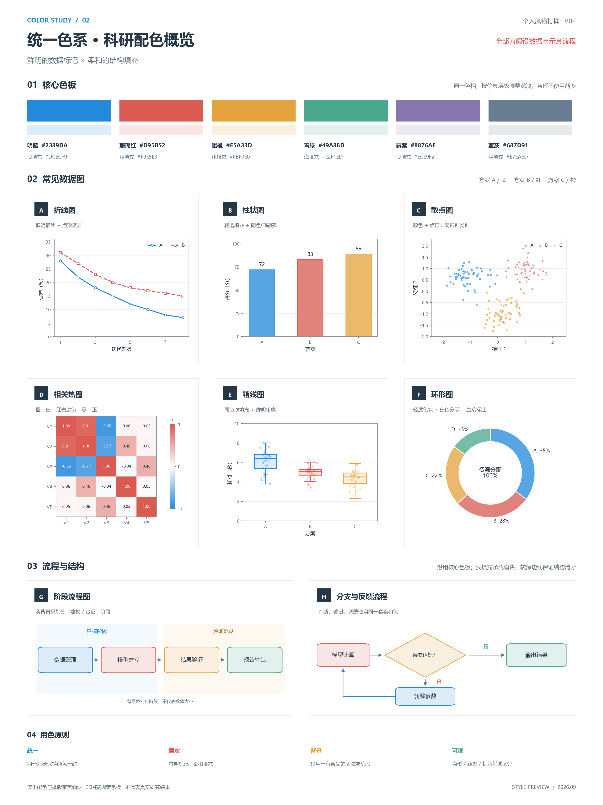

# CUMCM 论文绘图总控 Skill

根据完整数学建模论文、数据与代码规划和制作图表，按图型选择渲染器，并检查数值、文字、版面、灰度、导出和来源证据。配色只使用已确认的 V02 基准，不提供版本切换。

## 安装与使用

下载 ZIP 或克隆仓库，将 `.agents/skills/cumcm-figure-orchestrator` 整个目录复制到你的项目 `.agents/skills/`，或个人 `~/.codex/skills/`。不要只复制 SKILL.md。重新开启 Codex 会话后调用：

```text
$cumcm-figure-orchestrator
请根据这份完整论文、数据和代码制作图表，使用默认配色，检查数值与版面，并交付可复现源码。
```

也可直接在本仓库工作。入口：[SKILL.md](.agents/skills/cumcm-figure-orchestrator/SKILL.md)。论文、数据及结果存在冲突或缺失时，应报告受影响图表，不能补造研究结果。

## 配色：V02 唯一基准

六色体系：blue、coral、amber、violet、teal，另加专职中性参考的 slate。简单分类图按 blue → coral → amber → violet → teal 的最少色数取用，不机械用满。柱条、环形等大面积填充使用 76% 原色 + 24% 白色，流程节点与箱线使用 16% 原色 + 84% 白色。



样张全部为假设数据与示意流程，不是研究结论或国赛官方色板。规则见[配色基线](.agents/skills/cumcm-figure-orchestrator/references/personal-color-baseline.md)与[个人图表风格](.agents/skills/cumcm-figure-orchestrator/references/personal-figure-style.md)。

## 版面与线条规则

除数值与来源验证外，正式图还须通过下列结构规则，由 `scripts/matplotlib_layout_qa.py` 自动校验并绑定证据：

1. **坐标轴四周封闭**：直角坐标数据图四边 spine 全部可见；刻度与刻度标签默认只在左边和底边，顶/右刻度要开必须写明理由。
2. **组图子图比例**：同一 figure 内两个及以上数据子图时，每个绘图区宽高比必须命中 `1:1`、`4:3` 或 `16:9`（容差 ±2%，允许倒数镜像），禁止细长条与极扁面板。
3. **同级子图等大**：真实绘图区宽高差异默认不超过 2%。
4. **文字净空**：文字与实线、marker、柱边界、边框保持至少 4 pt 间距；图例不得覆盖数据。
5. **线条连续性**：每条实线数据线声明 `continuous` / `discrete` / `step` / `piecewise_linear`。连续量画成平滑曲线而非折线，并声明原始数据包络，禁止过冲或凭空造峰；离散量保持原始采样点。
6. **语义门控**：平滑与否取决于变量的科学含义。负载预测、光伏风电功率、温度、连续传感器量可以平滑；分时电价、开关量、整数决策、时段调度功率、充放电控制、分段政策、事件计数必须保持 step/stairs/柱状。

样式参数集中在 `assets/personal-figure-style.json`，配色数值在 `assets/personal-color-baseline.json`，辅助函数见 `scripts/figure_style.py`。

## 运行环境

建议 Python 3.11+，创建独立虚拟环境，然后安装基本依赖：

```sh
python -m pip install -r requirements.txt
python .agents/skills/cumcm-figure-orchestrator/scripts/check_environment.py
python -B -m unittest discover -s tests -v
```

基础依赖支持数据图和核心验证；D2、Graphviz、R、地理库及其他 Agent Skills 按任务另行安装，未随仓库附带。Windows 的 D2 安装/渲染脚本依赖 PowerShell 与 Edge；其他平台须使用适合本机的渲染链。中文图需要本机可用的中文字体。依赖不足时由路由报告或选择满足约束的备选。

## 示例与验证边界

`examples/paper-plan.json` 是规划/回归夹具，引用的是占位路径，不是可直接验收的论文。`scripts/demo_batch.py --out outputs/demo`（完整脚本位于 Skill scripts 下）可生成合成验收批次，其中演示了封闭边框、4:3 面板与 `discrete` 线条声明；视觉检查仍需实际执行。不得将测试中的模拟审查证据复制到正式论文。

正式交付要求见[生产契约](.agents/skills/cumcm-figure-orchestrator/references/production-contract.md)。自动检查不保证论文推导正确，尚未完成多篇完整论文的端到端评测。参赛前需核对当年赛区格式及 AI 使用要求。

## 变更记录

- 移除 V03 配色及其版本切换机制，V02 成为唯一基准。
- 新增 `axes_frame_closed`、`panel_aspect_whitelist`、`curve_smoothing` 三项自动检查，样式类检查由 3 项增至 6 项。
- 新增 `scripts/figure_style.py`（配色选择、连续性声明、封闭边框套用）与 `tests/test_figure_style.py`。
- 收紧门禁后，早于本次变更的批次需要按新规范重出才能通过严格校验。
